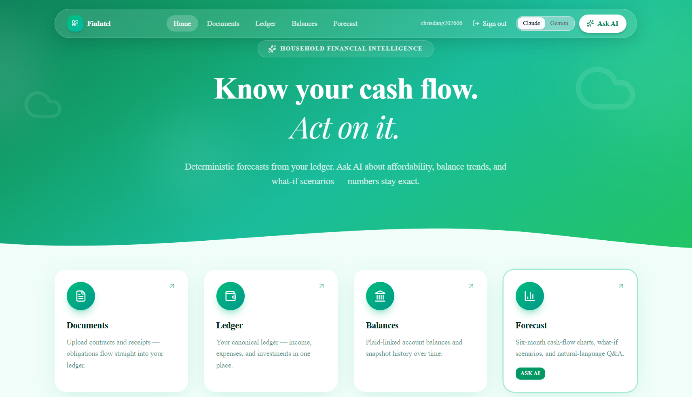
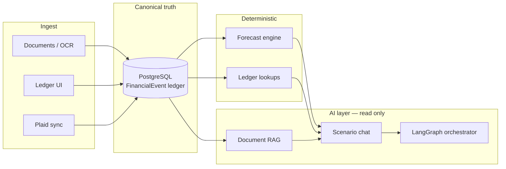
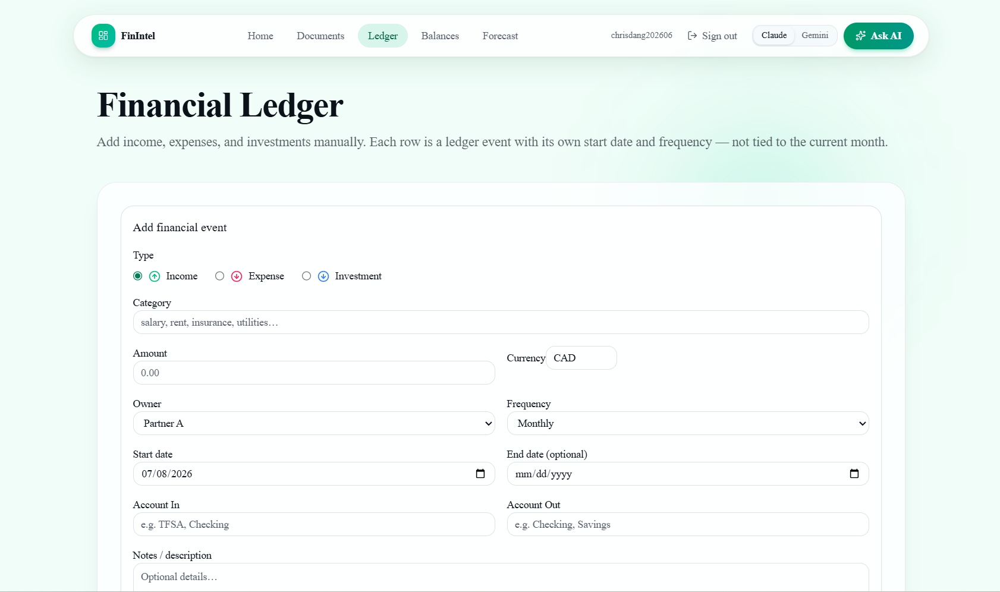
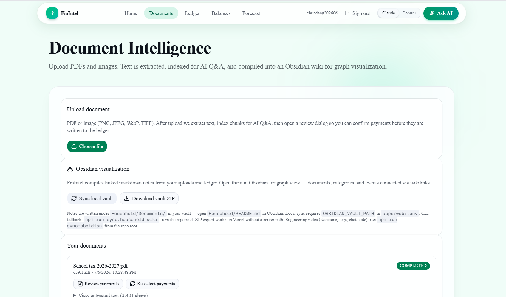
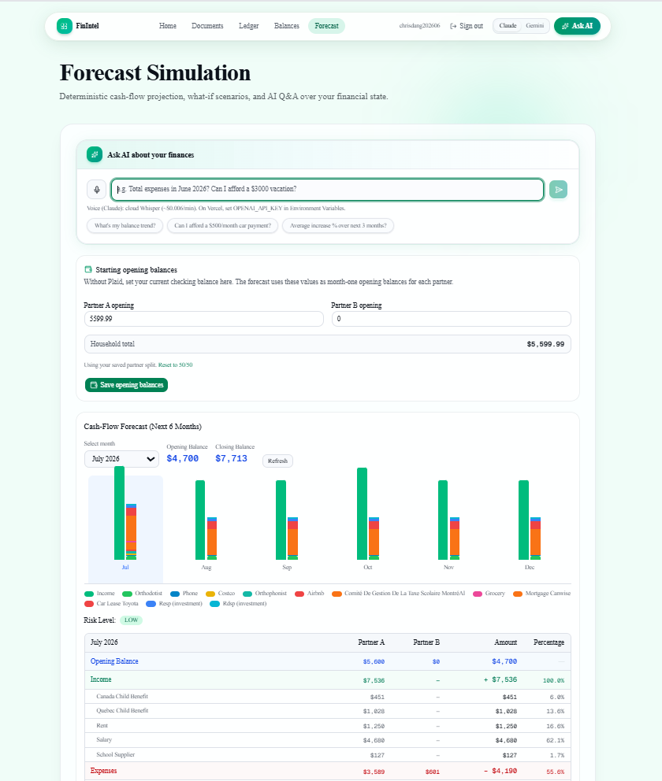
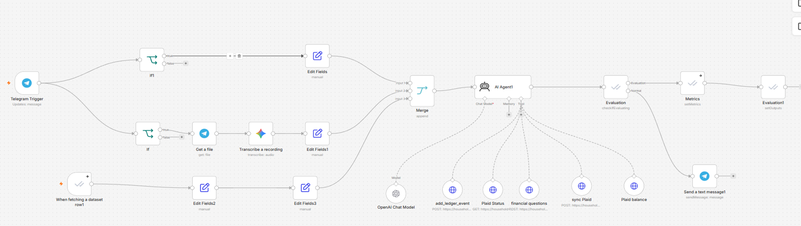

# Household Financial Intelligence

> **Deterministic household finance + AI explanation.** Upload bills, sync bank balances, run cash-flow forecasts, and ask natural-language questions — the LLM routes and narrates; it never owns the ledger or the math.

[](https://github.com/ChrisDANG-data/household_financial/actions/workflows/ci.yml)
[](https://household-financial-web.vercel.app)
[](https://nextjs.org/)
[](https://www.typescriptlang.org/)
[](https://www.prisma.io/)

**Live app:** https://household-financial-web.vercel.app



---

## Why this project

Household money lives in spreadsheets, bank apps, and PDF folders. Generic chatbots guess at totals. This app centralizes **one financial truth** in PostgreSQL and uses AI only where it adds value — document retrieval, routing, and explanation — while **forecasts, ledger totals, and affordability checks stay deterministic**.

**Core design rule:** *AI never calculates money.*

### Questions this app answers

1. **Has my asset last year beaten inflation?**
2. **How much contributions have been made into RESP, TFSA, RRSP?**
3. **Do I have enough cash for upcoming installment of property tax?**

| Question | How it's answered |
|----------|-------------------|
| "Has my asset last year beaten inflation?" | Ledger + investment balances vs inflation context |
| "How much into RESP, TFSA, RRSP?" | Investment / contribution totals from ledger & manual accounts |
| "Enough cash for property tax installment?" | Forecast + disposable assets + obligation lookup |
| "Can we afford a $20K trip in July?" | Forecast engine + advisor narration |
| "What's in our house insurance policy?" | Document RAG over uploaded PDFs |
| "What's Partner B's monthly income?" | Owner-scoped ledger query |

---

## Highlights

- **Four-engine architecture** — Document Intelligence, Financial State (ledger), Forecast Simulation, AI Explanation — with strict dependency boundaries ([docs/ARCHITECTURE.md](docs/ARCHITECTURE.md))
- **Hybrid scenario chat** — TypeScript fast-path for simple queries; **LangGraph** multi-agent orchestration for complex what-if questions ([services/langgraph-orchestrator](services/langgraph-orchestrator))
- **Document pipeline** — PDF/image upload → OCR/extraction → human review → canonical `FinancialEvent` → embeddings for RAG
- **Plaid integration** — Link accounts, sync balances, encrypted token storage, disposable-assets view
- **Production hardening** — Per-user auth, session cookies, AES-256-GCM for Plaid tokens, fail-closed automation webhooks ([docs/PRIVACY.md](docs/PRIVACY.md))
- **Automation** — n8n + Telegram workflows calling the same secured APIs as the web UI ([docs/INTEGRATIONS.md](docs/INTEGRATIONS.md))
- **125 unit tests** across 28 Vitest suites — simulation, dedupe, RAG routing, Plaid, auth, automation

---

## What I built

*Final project — 2026 Inference AI Course. Replace bullets with your personal contributions if collaborating.*

- Designed the **canonical `FinancialEvent` model** and deterministic projection engine (`projection.ts`, `simulation.ts`) — forecasts are computed in code, not by an LLM
- Implemented **hybrid scenario-chat routing**: ledger lookup → LangGraph specialists → document RAG → forecast + advisor
- Built the **document intelligence vertical slice**: upload, extraction, obligation review UI, confirm-to-ledger, and Postgres-backed embeddings
- Added **Tier-1 privacy controls**: household login, scrypt password hashes, encrypted Plaid tokens, Bearer-protected automation routes
- Deployed **Next.js on Vercel**, **Neon Postgres**, and **LangGraph on Railway** with CI gates on every PR

---

## Architecture



**Dependency rule:** Document Intelligence ingests into Financial State. Forecast Simulation reads snapshots. AI Explanation and scenario chat receive **read-only context** — no direct DB writes, no invented balances.

Full detail: [docs/ARCHITECTURE.md](docs/ARCHITECTURE.md)

---

## Feature tour

| Module | URL | What it does |
|--------|-----|--------------|
| **Documents** | `/documents` | Upload PDFs/images; AI extracts payment schedules; review & confirm to ledger |
| **Ledger** | `/ledger` | Canonical income, expenses, investments — Partner A / B / Joint |
| **Balances** | `/balances` | Plaid-linked accounts, balance history, disposable assets |
| **Forecast** | `/simulation` | 6-month cash-flow charts, what-if scenarios |
| **Scenario chat** | `/scenario` | Natural-language Q&A — engines compute, AI explains |
| **Auth** | `/login` | Per-user sessions; data isolated by `userId` |

| Ledger | Documents |
|:------:|:---------:|
|  |  |

| Forecast + Ask AI | n8n / Telegram automation |
|:-----------------:|:-------------------------:|
|  |  |

### 60-second demo path

1. Open the [live app](https://household-financial-web.vercel.app) → **Create account**
2. **Ledger** → add a monthly expense (set Owner: Partner A or B)
3. **Documents** → upload a bill → **Review payments** → set Owner → **Confirm & add to ledger**
4. **Forecast** → view 6-month projection
5. **Scenario chat** → ask *"Can we afford $5,000 travel in August?"*

---

## Tech stack

| Layer | Technology |
|-------|------------|
| **Frontend** | Next.js 16 (App Router), React 19, Tailwind CSS v4, shadcn/ui |
| **Backend** | Next.js API routes, TypeScript services layer |
| **Database** | PostgreSQL (Neon), Prisma ORM 6 |
| **AI** | Anthropic Claude, OpenAI (embeddings/STT), structured output validation |
| **Orchestration** | LangGraph (Python FastAPI) on Railway |
| **Banking** | Plaid Direct API (encrypted tokens at rest) |
| **Documents** | MuPDF, Tesseract OCR, local + OpenAI embeddings |
| **Automation** | n8n, Telegram webhooks |
| **Deploy** | Vercel (web), Neon (DB), Railway (LangGraph) |
| **CI** | GitHub Actions — lint, 125 tests, production build |

---

## Quick start

### Prerequisites

| Tool | Version |
|------|---------|
| Node.js | 20.19+ recommended |
| PostgreSQL | 14+ (local, Docker, or Neon) |

### 1. Clone and install

```bash
git clone https://github.com/ChrisDANG-data/household_financial.git
cd household_financial
npm install
```

### 2. Configure environment

```bash
cp apps/web/.env.example apps/web/.env
# Set DATABASE_URL at minimum. See .env.example for AI, Plaid, auth, and LangGraph vars.
```

### 3. Database

```bash
# Option A: Docker Postgres (repo root)
docker compose up -d

# Option B: use Neon or local Postgres — set DATABASE_URL in apps/web/.env

cd apps/web
npx prisma db push
```

### 4. Run

```bash
# From repo root
npm run dev
```

Open http://localhost:3000

| URL | Purpose |
|-----|---------|
| http://localhost:3000 | Home — Documents, Ledger, Balances, Forecast |
| http://localhost:3000/scenario | Scenario chat |
| http://localhost:3000/api/health | Health check (`database: true` when Postgres is reachable) |

### 5. Tests (same as CI)

```bash
npm test
npm run build
```

### Optional: LangGraph orchestrator

```bash
cd services/langgraph-orchestrator
python -m venv .venv
. .venv/Scripts/activate   # Windows
pip install -r requirements.txt
set APP_WEB_BASE_URL=http://localhost:3000
uvicorn app.main:app --host 0.0.0.0 --port 8081
```

Set `LANGGRAPH_ENABLED=true` and `LANGGRAPH_URL=http://localhost:8081` in `apps/web/.env`. See [services/langgraph-orchestrator/README.md](services/langgraph-orchestrator/README.md).

---

## Project structure

```
├── apps/web/                    # Next.js app (UI + API)
│   ├── app/                     # App Router pages & API routes
│   ├── components/              # UI (documents, ledger, simulation, auth)
│   ├── services/                # Business logic (four engines + integrations)
│   ├── prisma/schema.prisma     # User, Document, FinancialEvent, Plaid, RAG chunks
│   └── __tests__/               # Vitest unit tests (28 suites)
├── services/langgraph-orchestrator/   # Python LangGraph multi-agent service
├── docs/                        # Architecture, privacy, integrations, CI
├── Presentation/                # Slide copy & Q&A for demos
└── .github/workflows/ci.yml     # Lint + test + build on every PR
```

### Data model (Postgres)

| Model | Role |
|-------|------|
| `User` | Household login; scopes all data by `userId` |
| `FinancialEvent` | Canonical ledger — forecasts and chat read this |
| `FinancialObligation` | Extracted from documents; human confirms → creates events |
| `Document` + `DocumentChunk` | Uploaded files + embeddings for RAG |
| `PlaidItem` + `PlaidBalanceHistory` | Linked accounts and sync history |

`FinancialState.computed` and timeline projections are **derived at read time**, never stored.

---

## Documentation

| Document | Description |
|----------|-------------|
| [docs/ARCHITECTURE.md](docs/ARCHITECTURE.md) | Four engines, AI boundaries, data flow |
| [docs/INTEGRATIONS.md](docs/INTEGRATIONS.md) | Plaid, LangGraph, n8n/Telegram, Vercel deploy |
| [docs/PRIVACY.md](docs/PRIVACY.md) | Data handling, encryption, access control |
| [docs/CI.md](docs/CI.md) | GitHub Actions workflow |
| [apps/web/.env.example](apps/web/.env.example) | All environment variables |
| [Presentation/PRESENTATION_QA.md](Presentation/PRESENTATION_QA.md) | 30 Q&A for architecture deep-dives |
| [services/langgraph-orchestrator/RAILWAY.md](services/langgraph-orchestrator/RAILWAY.md) | LangGraph production deploy |

---

## Deployment

| Service | Platform | Notes |
|---------|----------|-------|
| Web app | **Vercel** | Root directory: `apps/web` |
| Database | **Neon** | `DATABASE_URL` in Vercel env |
| LangGraph | **Railway** | `LANGGRAPH_URL` in Vercel env |

**Required Vercel env vars for production auth:**

```env
AUTH_SECRET=<random 32+ characters>
TOKEN_ENCRYPTION_KEY=<32-byte key>
AUTOMATION_WEBHOOK_TOKEN=<random token>
AUTH_ALLOW_REGISTRATION=true
```

Full checklist: [docs/INTEGRATIONS.md](docs/INTEGRATIONS.md) (Vercel env vars section)

---

## Screenshots

Screenshots live in [`docs/images/`](docs/images/). The **hero** (home page) is at the top of this README; the gallery under **Feature tour** shows ledger, documents, forecast/Ask AI, and n8n automation.

See [docs/images/README.md](docs/images/README.md) to replace or add captures.

---

## License

Course final project. Add an MIT license if you open-source for portfolio use.
